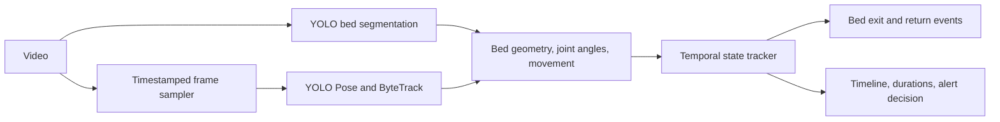

# Elderly Activity and Bed-Exit Monitor

This system uses pretrained YOLO models to analyze a fixed-camera video,
detects one person, estimates their activity relative to a configured bed region, smooths
observations over time, and produces a JSON timeline, bed-exit/return events, durations,
and a `NORMAL`/`MONITOR`/`ALERT` decision.



## Code structure

For per-camera mattress-top/floor calibration and the unified extra-frame motion
history, see [surface calibration](evaluation/surface_calibration.md).
The default Gemini policy now uses bracketed sequence corrections, a fragmentation
check, bounded retries and response caching. See [review reliability](evaluation/review_reliability.md)
for configuration, limitations and replay results; older point-correction details
below describe the optional `gemini_correction_policy: legacy` mode.

```text
elderly_monitor/
  config.py             Application settings, defaults and loading
  models.py             Shared observations, states, segments and events
  pipeline.py           Coordinates analysis
  vision/
    bed_detector.py     YOLO bed segmentation and occupancy boundary
    pose_detector.py    YOLO Pose and ByteTrack identity selection
    pose_observer.py    Pose and bed geometry to activity evidence
    geometry.py         Polygon and distance calculations
  temporal/
    tracker.py          Temporal smoothing, durations and summary assembly
    events.py           Spatial bed-exit and return confirmation
    alerts.py           Recording-level decisions and reasons
    states.py           Shared in-bed/out-of-bed state groups
  video/
    reader.py           Metadata, frame sampling and segment access
    annotations.py      Overlay drawing and annotated video writing
  review/
    agent.py            Chooses context windows and enforces review budgets
    evidence.py         Collects extra frames with conservative identity matching
    gemini.py           Optional Gemini visual review and validated responses
tests/                  Regression tests
evaluation/             Ground-truth templates and comparison metrics
tools/                  Manual bed-region selector
monitor.py              CLI entry point
```

Imports now use the package locations, for example
`from elderly_monitor.temporal.tracker import TemporalStateTracker` and
`from elderly_monitor.config import load_config`. The CLI commands and JSON format
remain unchanged. For activity accuracy, duration errors and event precision/recall,
follow the [evaluation workflow](evaluation/README.md). Label templates must be
manually completed before calculating real accuracy.

## Run

Requires Python 3.10 or newer.

```powershell
python -m venv .venv
.venv\Scripts\Activate.ps1
pip install -r requirements.txt
Copy-Item config.example.json config.json
python monitor.py path\to\video.mp4 --config config.json --output output\result.json --annotated-video output\annotated.mp4
```

With `bed_region_mode: "auto"`, YOLO segmentation (`yolo11n-seg.pt`) samples five
frames from the first four seconds, checks mask agreement, and uses a detected bed
polygon for that video. The model downloads on first use. Automatic mode refreshes the
region once and keeps it fixed by default (`refresh_bed_each_sample: false`). This
prevents a standing person obscuring the bed from invalidating the calibrated region.
The camera and bed must stay fixed. Set `refresh_bed_each_sample: true` to opt into
re-detection; in that mode missing or ambiguous beds produce UNKNOWN. Re-detection
is not camera stabilization: camera movement can still distort walking-speed estimates
and person tracking. Manual regions remain fixed.

The occupancy polygon is a convex envelope around the segmented bed, bridging gaps
where the person hides it. This preserves angled edges but can include nearby floor,
headboards or furniture; it is an approximation, not an exact mattress mask. Inspect
the overlay or use a manual polygon for a fixed camera when the envelope is unsuitable.
Initial raw segmentation and calibration details are in `analysis.bed_region`; refreshed
occupancy polygons are stored per observation with `--include-observations`.

If detection fails or beds are ambiguous, analysis stops instead of reusing an unrelated
ROI. For manual correction, run `python tools/select_bed_region.py path\to\video.mp4`:
click around the mattress boundary, press Enter to save, Backspace to undo, or Escape
to cancel. This preserves other configuration settings and selects manual mode.
Manual regions must be recalibrated for a different camera view; coordinates outside
the video frame are rejected. Automatic masks may include bed frames and headboards,
and are not guaranteed to identify only the mattress surface.

Run the state/event tests with:

```powershell
python -m unittest discover -s tests -v
```

## Pose detection and tracking

The default detector is pretrained `yolo11n-pose.pt` with ByteTrack. The first run
downloads weights; no model training is needed. It runs on CPU by default. Set
`device` in the configuration to change the inference device.

The system selects the only tracked person overlapping the bed and locks their ID.
Start the video with the monitored person alone at the bed. If multiple people overlap
the bed, selection waits; `target_track_id` can explicitly select an ID. Missing target
tracks produce UNKNOWN rather than switching to another person. ByteTrack cannot
guarantee identity after long occlusions or distinguish caregiver roles semantically.

Posture uses shoulder/hip orientation and knee angles, bed membership uses hip position,
and movement uses hip speed. These are camera-dependent rules, not a trained activity
classifier. Hidden legs or uncertain torso joints can produce UNKNOWN. Annotated video
shows the skeleton, target ID, raw candidate state and reason; JSON timeline states are
temporally smoothed. Use `--include-observations` for joint coordinates and reasons.

Bed calibration supports automatic segmentation and manual polygons. Optional Gemini VLM
review is available. Person detection uses only `yolo_pose`; the old HOG,
background-subtraction and box-shape classification paths have been removed.
Geometry and temporal rules remain necessary to convert model outputs into activity
states, bed-exit events and duration summaries. OpenCV handles video I/O, masks,
annotations and the optional manual polygon editor.
Tracking integration follows https://docs.ultralytics.com/modes/track/.

## Temporal review, events and decisions

The tracker reviews timestamped observations offline at the end of the video. Each sample
represents the interval until the next sample, with a cap on how long missing samples
can be extrapolated. Leading gaps, missing frames, low confidence and uncertain poses
are UNKNOWN. Durations include all seven states and sum to the video duration (subject
to millisecond rounding). Calling `finish()` again does not duplicate segments or events.

Activity smoothing and event confirmation use separate thresholds:

| Setting | Default | Meaning |
| --- | --- | --- |
| `state_hold_sec` | 1.5 | Minimum duration for non-bed activity runs |
| `posture_hold_sec` | 0.6 | Minimum duration for lying/sitting on bed |
| `event_hold_sec` | 1.5 | Continuous spatial evidence before exit/return confirmation |
| `context_gap_sec` | 2.0 | UNKNOWN gap that invalidates remembered bed-event context |
| `min_state_confidence` | 0.35 | Below this, the observation becomes UNKNOWN |
| `sitting_monitor_sec` | 120 | Sustained sitting on bed warrants MONITOR |
| `alert_after_out_of_bed_sec` | 300 | Continuous confidently-away evidence warrants ALERT |

A short activity flicker is replaced only when its sufficiently long neighbours agree
and have the same person ID. Other unsupported short runs become UNKNOWN. Raw UNKNOWN
intervals are never filled with a guessed activity. Video overlays explicitly label raw
predictions as `candidate`; the JSON timeline contains the offline reviewed states.
When standing/walking labels flicker but sustained spatial evidence confirms the person
is away, short detailed activity runs become the broader OUT_OF_BED state rather than
discarding the known location.

Bed exits require a known in-bed baseline followed by sustained standing, walking,
sitting outside the bed or OUT_OF_BED, with known bed geometry. Standing beside the
bed counts as loss of bed support; moving farther away is not required. The default
confirmation hold is 1.5 seconds, so a brief stand-and-sit does not confirm an exit.
Changes between standing and walking do not restart the evidence window. Returns
require sustained sitting/lying on the bed. Initial absence establishes a baseline
without inventing an exit before the video began.
Short UNKNOWN gaps retain the baseline but reset candidate evidence; long gaps and
target ID changes discard the baseline. UNKNOWN never contributes to confirmed absence.

Summary decisions describe the whole recording, not a live notification:
- ALERT: the longest continuously confirmed absence reaches the configured threshold.
- MONITOR: any reviewed UNKNOWN time, prolonged sitting on bed, or an exit without a
  confirmed return.
- NORMAL: none of those conditions occurred.

`decision_reasons` explains the outcome. `temporal_reviews` records event confirmations
and context decisions. `longest_confirmed_away_sec` is spatially verified absence;
`longest_out_of_bed_period_sec` is based on activity labels and may include standing
beside the bed. Events use sustained posture with known bed context, while the activity timeline uses posture
smoothing, so their boundaries need not exactly coincide. These are configurable
demonstration policies; prolonged sitting is not a measured clinical risk or edge detector.

An agentic review controller now requests additional video frames around uncertain
observations and activity transitions. It uses deterministic decisions, not a VLM.
Actual activity accuracy, event precision/recall and duration errors still need
manually labelled clips. Synthetic regression tests do not substitute for that evaluation.

## Agentic evidence review

`review/agent.py` plans nonoverlapping context windows; `review/evidence.py` reads extra
frames and runs a separate pose model without rewinding the first-pass ByteTrack instance.
The pipeline merges new timestamps and rebuilds the temporal summary. Original observations
are retained, including UNKNOWN: extra frames add evidence rather than overriding it.

Review defaults: enabled, 2 seconds of context on each side, 9 requested FPS, at most
3 windows and 120 extra frame attempts, one attempt per window. Set `review_enabled`
to false for the original single pass. Sampling is limited by source FPS. Windows are
processed chronologically, so a limited budget can leave later cases unreviewed.

Identity is checked against interpolated boxes from two nearby first-pass detections
with the same target ID (maximum gap 1 second). Review requires exactly one overlapping
person detection. Missing anchors are skipped; ambiguous matches produce UNKNOWN.
This is conservative geometric association, not appearance re-identification, and cannot
guarantee identity during caregiver overlap or recover a long-lost target.

`agentic_review` logs triggers, windows, attempts, identity rejections and before/after
unknown time, event counts and decisions. More evidence may increase uncertainty; the
controller does not force a known label. `observations`, when requested, includes added
samples. The annotated video still shows first-pass candidate predictions, while the
JSON timeline includes review evidence (`analysis.annotation_evidence` makes this explicit).

## Optional Gemini reviewer

Set `gemini_enabled` to true in your configuration. Put your key in the project-root
`.env` file (copy `.env.example` if needed):

```dotenv
GEMINI_API_KEY=your-api-key
```

Then run:

```powershell
python monitor.py videos\japan_cctv.mp4 --config config.json --output output\result.json --include-observations
```

Create a key in Google AI Studio: https://aistudio.google.com/apikey . Do not store it in
config.json, source files or commits. The CLI automatically loads `GEMINI_API_KEY` from
the project-root `.env`, regardless of the working directory. Existing shell variables
take precedence. Blank values and comments are ignored; single/double quoted keys are
supported. The loader only reads this key, with no variable expansion or shell execution.
Library callers can explicitly call `elderly_monitor.environment.load_project_env()`.
`.env` is ignored by Git; only the blank `.env.example` template is shareable.
The client uses the standard-library HTTPS API; no extra SDK installation is needed.

The current project config enables Gemini; the example config leaves cloud review off.
Without a key, review is skipped and `gemini_review.status` explains why. The default
model is `gemini-3.1-flash-lite`; `gemini_model` can select another compatible vision model.
Model availability depends on your API account. Request format follows Google's
GenerateContent API: https://ai.google.dev/api/generate-content .

At most 3 requests are sent per recording, with up to 5 JPEG frames each, resized to a
maximum dimension of 768 pixels. Frames include the green target box and blue approximate
bed boundary, timestamps and the review instruction. These images leave your computer
and are processed by Google; applicable billing and data-use terms depend on your tier.
Timeout is 30 seconds per request, output is capped at 2048 tokens, and there are no
automatic retries. Configuration permits at most 10 requests and 8 images per request.

Responses must contain one valid state, confidence, identity-clarity flag and visual
explanation per supplied frame. UNKNOWN posture observations require an existing target
ID, box and bed polygon to be updated. A conflicting known label additionally requires
a neighbouring Gemini assessment within 1.5 seconds to agree and local observations
between those frames to support that state. Identity changes, missing boxes and UNKNOWN
gaps block these corrections. Support is evaluated from original evidence, so accepted
corrections cannot recursively justify further changes. Bed-related labels must agree
with the spatial relation, and WALKING requires the configured movement-speed threshold.
Identity and bed detection failures remain unresolved. Each decision includes an
acceptance/rejection reason and supporting timestamps. Model confidence is a self-report, not calibrated
accuracy. Validated updates go through the temporal tracker; Gemini cannot directly
create events or alerts. Missing keys, timeouts, rejected/invalid responses and API errors
preserve the local analysis. No key or encoded image is written into results.

`gemini_review` records per-frame assessments, accepted updates, errors by type and token
usage. The annotated video still displays first-pass candidates; the JSON includes
accepted corrections only at assessed timestamps; other frames are not relabelled by
interpolation. HTTP failures include `http_status` and `error_category` (for example,
429 means rate limit or quota), without logging provider bodies or credentials. Old
HTTPError entries cannot be diagnosed retroactively without a saved status code.
The JSON includes
accepted Gemini evidence. The integration is tested with mocked API responses; a live
call and labelled evaluation are still needed before claiming an accuracy improvement.

The supplied `Supine-to-Sit.mp4` contains an overlapping caregiver and patient. In the
initial YOLO run, the pose mixes joints from both people and then loses the target.
Its labels are not reliable ground truth. Use a fixed camera with the monitored person
fully visible and initially alone to evaluate the basic pipeline, then evaluate caregiver
occlusion separately. `analysis.known_observation_fraction` and `analysis.warnings`
report low coverage, but do not detect every incorrect pose or identity assignment.
