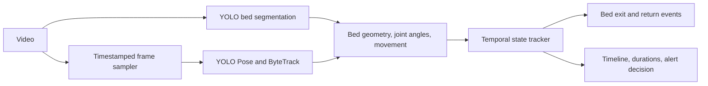

# Elderly Activity and Bed-Exit Monitor

This system uses pretrained YOLO models to analyze a fixed-camera video,
detects one person, estimates their activity relative to a configured bed region, smooths
observations over time, and produces a JSON timeline, bed-exit/return events, durations,
and a `NORMAL`/`MONITOR`/`ALERT` decision.



## Code structure

```text
elderly_monitor/
  config.py             Application settings, defaults and loading
  models.py             Shared observations, states, segments and events
  pipeline.py           Coordinates analysis
  vision/
    bed_detector.py     YOLO bed segmentation and occupancy boundary
    pose_detector.py    YOLO Pose and ByteTrack identity selection
    pose_observer.py    Pose and bed geometry to activity evidence
    geometry.py         Polygon and distance calculations
  temporal/
    tracker.py          Temporal smoothing, durations and summary assembly
    events.py           Spatial bed-exit and return confirmation
    alerts.py           Recording-level decisions and reasons
    states.py           Shared in-bed/out-of-bed state groups
  video/
    reader.py           Metadata, frame sampling and segment access
    annotations.py      Overlay drawing and annotated video writing
tests/                  Regression tests
tools/                  Manual bed-region selector
monitor.py              CLI entry point
```

Imports now use the package locations, for example
`from elderly_monitor.temporal.tracker import TemporalStateTracker` and
`from elderly_monitor.config import load_config`. The CLI commands and JSON format
remain unchanged. Review-agent and evaluation modules will be added when implemented;
there are no placeholder packages for them yet.

## Run

Requires Python 3.10 or newer.

```powershell
python -m venv .venv
.venv\Scripts\Activate.ps1
pip install -r requirements.txt
Copy-Item config.example.json config.json
python monitor.py path\to\video.mp4 --config config.json --output output\result.json --annotated-video output\annotated.mp4
```

With `bed_region_mode: "auto"`, YOLO segmentation (`yolo11n-seg.pt`) samples five
frames from the first four seconds, checks mask agreement, and uses a detected bed
polygon for that video. The model downloads on first use. Automatic mode refreshes the
region at each sampled frame by default (`refresh_bed_each_sample: true`). Missing or
ambiguous beds produce UNKNOWN rather than using a stale region. This helps with
changing framing but is not camera stabilization: camera movement can still distort
walking-speed estimates and person tracking. Manual regions remain fixed.

The occupancy polygon is a convex envelope around the segmented bed, bridging gaps
where the person hides it. This preserves angled edges but can include nearby floor,
headboards or furniture; it is an approximation, not an exact mattress mask. Inspect
the overlay or use a manual polygon for a fixed camera when the envelope is unsuitable.
Initial raw segmentation and calibration details are in `analysis.bed_region`; refreshed
occupancy polygons are stored per observation with `--include-observations`.

If detection fails or beds are ambiguous, analysis stops instead of reusing an unrelated
ROI. For manual correction, run `python tools/select_bed_region.py path\to\video.mp4`:
click around the mattress boundary, press Enter to save, Backspace to undo, or Escape
to cancel. This preserves other configuration settings and selects manual mode.
Manual regions must be recalibrated for a different camera view; coordinates outside
the video frame are rejected. Automatic masks may include bed frames and headboards,
and are not guaranteed to identify only the mattress surface.

Run the state/event tests with:

```powershell
python -m unittest discover -s tests -v
```

## Pose detection and tracking

The default detector is pretrained `yolo11n-pose.pt` with ByteTrack. The first run
downloads weights; no model training is needed. It runs on CPU by default. Set
`device` in the configuration to change the inference device.

The system selects the only tracked person overlapping the bed and locks their ID.
Start the video with the monitored person alone at the bed. If multiple people overlap
the bed, selection waits; `target_track_id` can explicitly select an ID. Missing target
tracks produce UNKNOWN rather than switching to another person. ByteTrack cannot
guarantee identity after long occlusions or distinguish caregiver roles semantically.

Posture uses shoulder/hip orientation and knee angles, bed membership uses hip position,
and movement uses hip speed. These are camera-dependent rules, not a trained activity
classifier. Hidden legs or uncertain torso joints can produce UNKNOWN. Annotated video
shows the skeleton, target ID, raw candidate state and reason; JSON timeline states are
temporally smoothed. Use `--include-observations` for joint coordinates and reasons.

Bed calibration now supports automatic segmentation and manual polygons. Optional VLM
review is not implemented. Person detection uses only `yolo_pose`; the old HOG,
background-subtraction and box-shape classification paths have been removed.
Geometry and temporal rules remain necessary to convert model outputs into activity
states, bed-exit events and duration summaries. OpenCV handles video I/O, masks,
annotations and the optional manual polygon editor.
Tracking integration follows https://docs.ultralytics.com/modes/track/.

## Temporal review, events and decisions

The tracker reviews timestamped observations offline at the end of the video. Each sample
represents the interval until the next sample, with a cap on how long missing samples
can be extrapolated. Leading gaps, missing frames, low confidence and uncertain poses
are UNKNOWN. Durations include all seven states and sum to the video duration (subject
to millisecond rounding). Calling `finish()` again does not duplicate segments or events.

Activity smoothing and event confirmation use separate thresholds:

| Setting | Default | Meaning |
| --- | --- | --- |
| `state_hold_sec` | 1.5 | Minimum duration for non-bed activity runs |
| `posture_hold_sec` | 0.6 | Minimum duration for lying/sitting on bed |
| `event_hold_sec` | 1.5 | Continuous spatial evidence before exit/return confirmation |
| `context_gap_sec` | 2.0 | UNKNOWN gap that invalidates remembered bed-event context |
| `min_state_confidence` | 0.35 | Below this, the observation becomes UNKNOWN |
| `sitting_monitor_sec` | 120 | Sustained sitting on bed warrants MONITOR |
| `alert_after_out_of_bed_sec` | 300 | Continuous confidently-away evidence warrants ALERT |

A short activity flicker is replaced only when its sufficiently long neighbours agree
and have the same person ID. Other unsupported short runs become UNKNOWN. Raw UNKNOWN
intervals are never filled with a guessed activity. Video overlays explicitly label raw
predictions as `candidate`; the JSON timeline contains the offline reviewed states.
When standing/walking labels flicker but sustained spatial evidence confirms the person
is away, short detailed activity runs become the broader OUT_OF_BED state rather than
discarding the known location.

Bed exits require a known in-bed baseline followed by sustained `bed_relation: away`.
Hip distance from the bed boundary is compared with 20% of torso length (minimum 5 px).
Standing near the bed alone does not confirm an exit. Changes between standing and
walking do not restart the spatial evidence window. A return requires sustained in-bed
evidence and starts at the return time, not the preceding exit. Initial absence can
establish an away baseline but does not invent an exit before the video began.
Short UNKNOWN gaps retain the baseline but reset candidate evidence; long gaps and
target ID changes discard the baseline. UNKNOWN never contributes to confirmed absence.

Summary decisions describe the whole recording, not a live notification:
- ALERT: the longest continuously confirmed absence reaches the configured threshold.
- MONITOR: any reviewed UNKNOWN time, prolonged sitting on bed, or an exit without a
  confirmed return.
- NORMAL: none of those conditions occurred.

`decision_reasons` explains the outcome. `temporal_reviews` records event confirmations
and context decisions. `longest_confirmed_away_sec` is spatially verified absence;
`longest_out_of_bed_period_sec` is based on activity labels and may include standing
beside the bed. Events use spatial evidence, while the activity timeline uses posture
smoothing, so their boundaries need not exactly coincide. These are configurable
demonstration policies; prolonged sitting is not a measured clinical risk or edge detector.

This is deterministic temporal context review, not a VLM agent that requests new video
segments. Actual activity accuracy, event precision/recall and duration errors still need
manually labelled clips. Synthetic regression tests do not substitute for that evaluation.

The supplied `Supine-to-Sit.mp4` contains an overlapping caregiver and patient. In the
initial YOLO run, the pose mixes joints from both people and then loses the target.
Its labels are not reliable ground truth. Use a fixed camera with the monitored person
fully visible and initially alone to evaluate the basic pipeline, then evaluate caregiver
occlusion separately. `analysis.known_observation_fraction` and `analysis.warnings`
report low coverage, but do not detect every incorrect pose or identity assignment.
