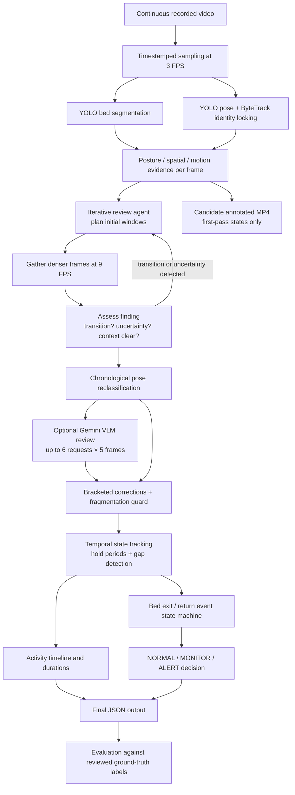

# Architecture

The review agent uses an iterative reasoning loop: findings from each dense-sampling
window (transition detected, upright near bed, uncertainty remains) trigger backward
or forward follow-up windows before committing. Gemini is a visual reviewer with strict
acceptance gates, not an unrestricted controller. Bed and pose networks are pretrained;
no new neural model is trained. Offline analysis can use earlier and later frames;
streaming would require buffering and delayed confirmation.
