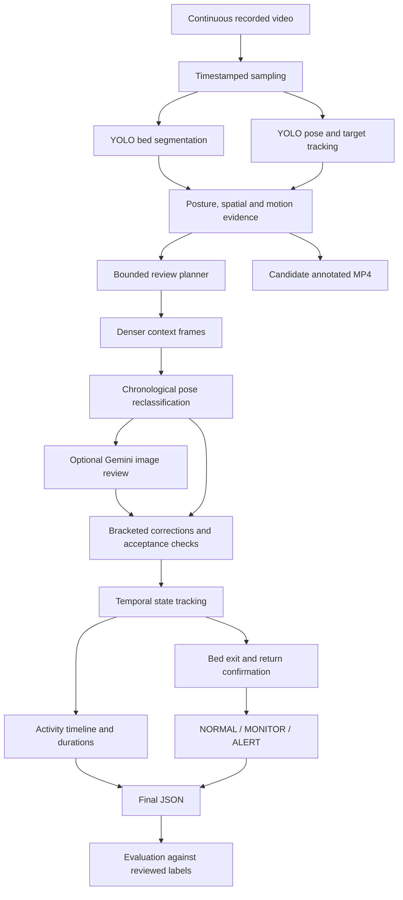

# Architecture

The planner decides when to gather evidence through rules and budgets. Gemini is a
visual reviewer, not an unrestricted controller. Bed and pose networks are pretrained;
no new neural model is trained. Image-space geometry and temporal rules convert their
outputs to activities. Offline analysis can use earlier and later frames; streaming
would require buffering and delayed confirmation.
