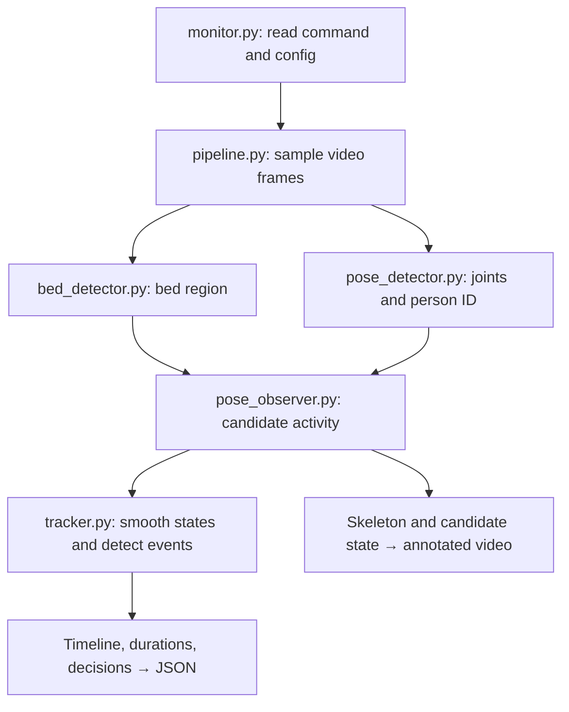

**`pipeline.py` connects all the components.** YOLO detects the bed and body joints; our Python logic converts those detections into activities, events, and summaries.

| Component | Code location | How it works |
|---|---|---|
| **Video input and sampling** | [`pipeline.py → analyze_video()`](<D:/projects/AIML assignment newnop/elderly_monitor/pipeline.py:48>) | Opens the video using OpenCV. Calculates which frames to analyze from `sample_fps`. For a 30 FPS video sampled at 3 FPS, it analyzes every tenth frame. |
| **Automatic bed segmentation** | [`bed_detector.py`](<D:/projects/AIML assignment newnop/elderly_monitor/bed_detector.py:7>) | `detect_bed_region()` checks initial frames. `detect_bed_frame()` refreshes detection during analysis. `occupancy_polygon()` forms an approximate full-bed boundary across areas hidden by the person. |
| **Person pose and tracking** | [`pose_detector.py → detect()`](<D:/projects/AIML assignment newnop/elderly_monitor/pose_detector.py:33>) | Runs YOLO Pose with ByteTrack. Returns the selected person’s bounding box, joint coordinates, confidence, and tracking ID. `select_target()` initially selects the only detected person sufficiently overlapping the bed, then retains their ID. |
| **Activity recognition** | [`pose_observer.py → observe()`](<D:/projects/AIML assignment newnop/elderly_monitor/pose_observer.py:18>) | Uses torso orientation, knee angles, hip position relative to the bed, and hip movement speed to propose an activity. Missing or ambiguous evidence produces `UNKNOWN`. |
| **Temporal smoothing** | [`tracker.py → update()`](<D:/projects/AIML assignment newnop/elderly_monitor/tracker.py:27>) | Maintains a current state and a candidate replacement. Normally requires the candidate to persist for `state_hold_sec` before accepting it. This filters flickering predictions but can miss short activities. |
| **Bed-exit and return events** | [`tracker.py → _commit_transition()`](<D:/projects/AIML assignment newnop/elderly_monitor/tracker.py:56>) | A confirmed transition from an in-bed state to an out-of-bed state creates `bed_exit`; the reverse creates `return_to_bed`. This is still basic transition logic. |
| **Durations and timeline** | [`tracker.py → finish()`](<D:/projects/AIML assignment newnop/elderly_monitor/tracker.py:80>) | Closes the final timeline segment, sums segment durations by activity, counts events, and calculates in-bed, out-of-bed, and unknown time. |
| **NORMAL / MONITOR / ALERT** | [`tracker.py`](<D:/projects/AIML assignment newnop/elderly_monitor/tracker.py:92>) | The final summary is `ALERT` if the longest continuous out-of-bed period reaches the configured threshold; otherwise `MONITOR` if the timeline contains `UNKNOWN`; otherwise `NORMAL`. Events also have their own decisions. |
| **Annotated video and JSON** | [`pipeline.py → _draw_annotation()`](<D:/projects/AIML assignment newnop/elderly_monitor/pipeline.py:24>) and [`monitor.py → main()`](<D:/projects/AIML assignment newnop/monitor.py:10>) | The pipeline draws the bed outline, person box, skeleton, and candidate activity, then writes video frames. `monitor.py` saves the returned summary as JSON. |

The activity rules in `pose_observer.py` currently work like this:

| Evidence | Candidate state |
|---|---|
| Horizontal torso, hips inside bed, sufficient bed overlap | `LYING_IN_BED` |
| Horizontal torso without those bed conditions | `OUT_OF_BED` |
| Upright torso and bent knees, hips inside bed | `SITTING_ON_BED` |
| Upright torso and bent knees, hips outside bed | `SITTING_OUTSIDE_BED` |
| Upright torso and extended legs, low movement speed | `STANDING` |
| Upright torso and extended legs, higher movement speed | `WALKING` |
| Missing joints or ambiguous posture | `UNKNOWN` |

Two supporting files are also essential:

- [`geometry.py`](<D:/projects/AIML assignment newnop/elderly_monitor/geometry.py:6>): checks whether hips are inside the bed polygon, approximates box–bed overlap, and measures movement distance.
- [`models.py`](<D:/projects/AIML assignment newnop/elderly_monitor/models.py:8>): defines the seven states and the `Observation`, `TimelineSegment`, and `Event` data structures.

**One important distinction:** the annotated video displays individual candidate predictions; the JSON timeline contains temporally filtered states. They can differ, as we saw with the short sitting interval.

For reading the code, start with **`monitor.py` → `pipeline.py` → `pose_observer.py` → `tracker.py`**.

---
# main changes

I used YOLO without using HOG to motion-detection, and bounding-box posture paths so the system consistently

used bed detection also with YOLO

The bed mask cut around the person, so their hips appeared “outside” the bed.
I changed the system to:
- Bridge obscured areas with an approximate full-bed boundary.
- Refresh bed detection as the framing changes.
- Use UNKNOWN when the bed cannot be detected.